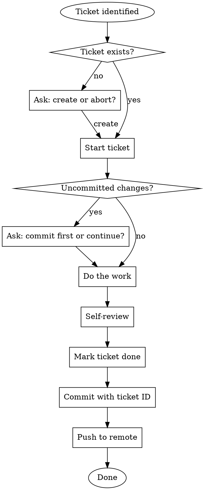

# Working on Tickets

## When This Applies

This skill activates when you're about to work on a ticket:

- User says "work on TCKTS-123"
- User says "fix TCKTS-123"
- User says "implement TCKTS-123"
- User says "do the ticket about X"
- User references a ticket ID and wants work done
- You're starting any task that has an associated ticket

## The Workflow



## Checklist

Follow this checklist for EVERY ticket:

### Before Work
- [ ] Verify ticket exists: `tckts show <ID>`
- [ ] If missing, create it: `tckts add -p <PREFIX> "description" -t <type>`
- [ ] Check for uncommitted changes: `git status`
- [ ] Start the ticket: `tckts start <ID>`

### During Work
- [ ] Do the implementation
- [ ] Run tests: `zig build test`
- [ ] Self-review your changes

### After Work
- [ ] Mark ticket done: `tckts done <ID>`
- [ ] Commit with ticket ID in message: `git commit -m "type: <ID> description"`
- [ ] Push to remote: `git push`

## Commands Reference

```bash
# Check ticket exists
tckts show TCKTS-123

# Create ticket if needed
tckts add -p TCKTS "Fix the bug" -t bug

# Start work
tckts start TCKTS-123

# Mark done
tckts done TCKTS-123

# Commit (always include ticket ID)
git commit -m "fix: TCKTS-123 resolve the issue"

# Push
git push
```

## Commit Message Format

Always include the ticket ID:

```
<type>: <TICKET-ID> <description>
```

Examples:
- `fix: TCKTS-123 resolve login validation`
- `feat: TCKTS-45 add pagination to list command`
- `chore: TCKTS-16 fix coding standard violations`

## Red Flags - You're Doing It Wrong

| Mistake | Correct Action |
|---------|----------------|
| Starting work without `tckts start` | Run `tckts start <ID>` first |
| Committing without marking done | Run `tckts done <ID>` before commit |
| Commit message missing ticket ID | Include `<ID>` in commit message |
| Forgetting to push | Always `git push` at the end |
| Multiple tickets in one commit | One ticket = one commit |

## Example Session

```
User: work on TCKTS-16

Assistant:
1. tckts show TCKTS-16  # Verify ticket exists
2. git status           # Check for uncommitted changes
3. tckts start TCKTS-16 # Start working
4. [do the implementation work]
5. zig build test       # Run tests
6. tckts done TCKTS-16  # Mark complete
7. git add -A && git commit -m "chore: TCKTS-16 fix coding violations"
8. git push
```
