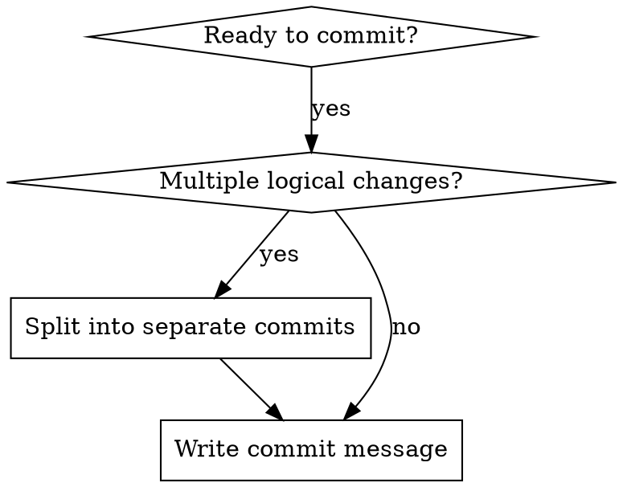
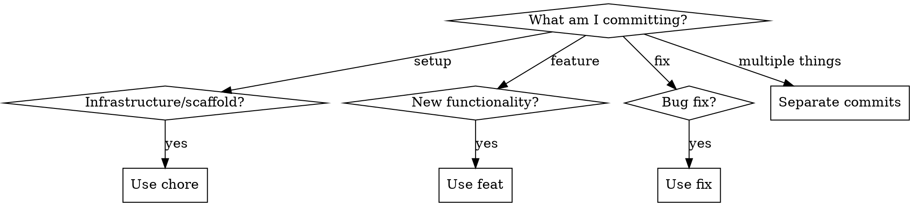

# Writing Git Commits

## Overview

Every commit tells a story. Follow Conventional Commits for machine-readable, human-understandable commit history.

**Core principle:** Each commit should be atomic — one logical change that could be reverted independently.

## When to Use



## Commit Message Format

```
<type>[optional scope]: <description>

[optional body]

[optional footer(s)]
```

### Types

| Type       | When to Use                         | SemVer |
| ---------- | ----------------------------------- | ------ |
| `feat`     | New feature or capability           | MINOR  |
| `fix`      | Bug fix                             | PATCH  |
| `chore`    | Maintenance, setup, config          | -      |
| `docs`     | Documentation only                  | -      |
| `refactor` | Code change without behavior change | -      |
| `test`     | Adding or fixing tests              | -      |
| `perf`     | Performance improvement             | -      |
| `ci`       | CI/CD changes                       | -      |
| `build`    | Build system changes                | -      |
| `style`    | Formatting, whitespace              | -      |

### Scopes

Use parentheses to indicate affected subsystem:

```
feat(toolkit): add new skill
fix(api): handle null response
chore(deps): update dependencies
```

### Breaking Changes

Mark with `!` before colon or `BREAKING CHANGE:` footer:

```
feat!: remove deprecated API

BREAKING CHANGE: The v1 API endpoints have been removed.
```

## Writing Good Descriptions

**DO:**

- Use imperative mood: "add feature" not "added feature"
- Keep under 50 characters
- Focus on WHY, not WHAT (code shows what)
- Be specific: "fix null pointer in auth flow" not "fix bug"

**DON'T:**

- End with period
- Use vague terms: "update", "change", "modify" without context
- Reference issue numbers in subject (use footer)

## Body Guidelines

- Separate from subject with blank line
- Wrap at 72 characters
- Explain motivation and contrast with previous behavior
- Use bullet points for multiple items

```
fix(auth): prevent session fixation on login

Previously, session IDs were preserved across authentication,
allowing potential session fixation attacks.

- Regenerate session ID after successful authentication
- Clear old session data before creating new session
- Add session rotation on privilege escalation
```

## Atomicity Guidelines



**Split commits when:**

- Adding scaffold AND functionality (two commits)
- Fixing multiple independent bugs
- Refactoring AND adding features
- Changes could be reverted independently

**Keep together when:**

- Changes are tightly coupled
- One change doesn't make sense without the other
- It's a single logical unit of work

## Examples

### Initial Project Setup (Multiple Commits)

```
# Commit 1: Foundation
chore: initialize project

Set up the foundation for the application.

# Commit 2: Tooling scaffold
chore(tooling): initialize development environment

Add configuration and tooling infrastructure.

- Build configuration
- Linting setup
- Development scripts

# Commit 3: First feature
feat(tooling): add code generation utilities

Implement utilities for generating boilerplate code.
```

### Feature Addition

```
feat(auth): add password reset flow

Allow users to reset passwords via email link.

- Add reset token generation with 1-hour expiry
- Create reset email template
- Add rate limiting (3 requests per hour)
```

### Bug Fix

```
fix(api): handle race condition in connection pool

Connections were being returned to pool before response
completion, causing intermittent failures under load.

Fixes #234
```

## HEREDOC Format for Multi-line Messages

Always use HEREDOC for commit messages with bodies:

```bash
git commit -m "$(cat <<'EOF'
feat(scope): description here

Body paragraph explaining the change.

- Bullet point one
- Bullet point two
EOF
)"
```

## Common Mistakes

| Mistake                     | Fix                                                      |
| --------------------------- | -------------------------------------------------------- |
| "Fixed stuff"               | Be specific: "fix(auth): prevent null pointer on logout" |
| Mixing concerns             | Split into atomic commits                                |
| Huge commits                | Break down by logical unit                               |
| No body for complex changes | Explain WHY, not just WHAT                               |
| Past tense "Added feature"  | Imperative "Add feature"                                 |

## Red Flags - Reconsider Your Commit

- Commit touches 10+ unrelated files
- Description needs "and" to explain changes
- You're tempted to write "various fixes"
- Changes span multiple subsystems for different reasons
- You can't summarize in under 50 characters

**If any apply:** Split into multiple atomic commits.
